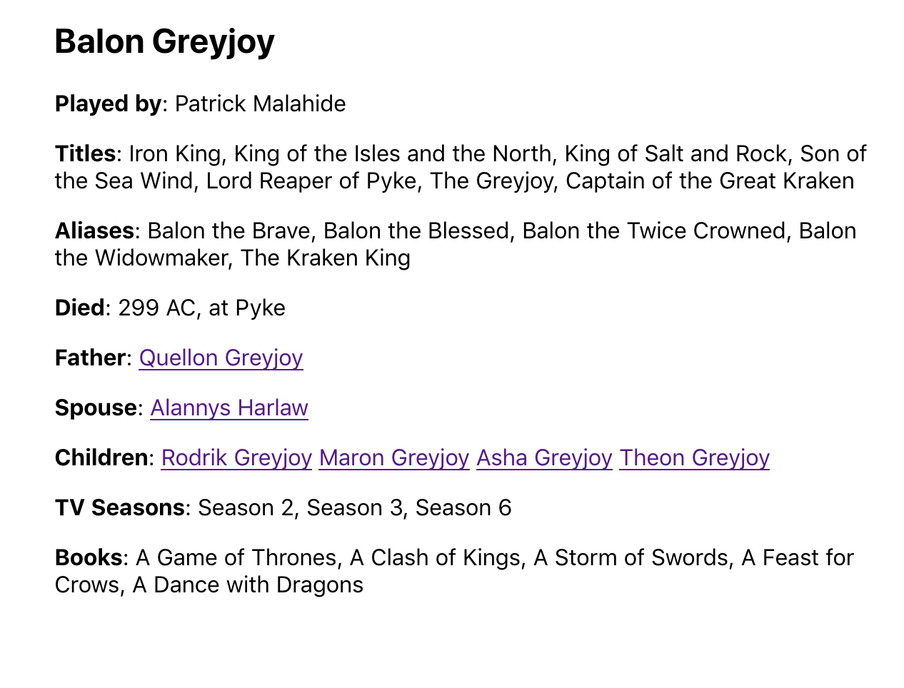
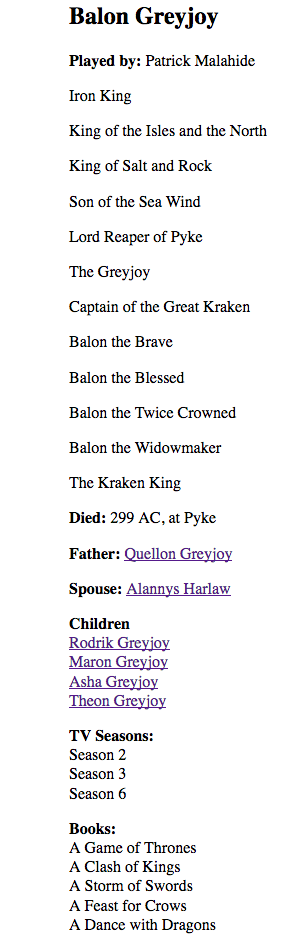

# Game of Thrones with ReasonML

see:<https://www.formidable.com/blog/2019/strong-typing/> for Typescript Version via [@smusumeche](https://twitter.com/smusumeche)'s excellent blog post. Thanks, Steve.

## Todo

- Figure out how to use `Belt.Array.concat` or some other method to get the items in `src/Detail.re` `allegiances to render with a comma between them. I need it to know how to get it to look like this:

- Figure out how to create and use graphql fragments using [reason-apollo](https://github.com/apollographql/reason-apollo)

## Notes

- I used [parceljs](https://github.com/parcel-bundler/parcel#readme) because create-react-app was throwing linting errors in `.bs.js` files after compilation and I could not turn them off with `.bs.js` in `.eslintignore`.

And not like this:

Worked it out with some help from the ReasonML community. See [src/Detail.re](./src/Detail.re) to see how.
